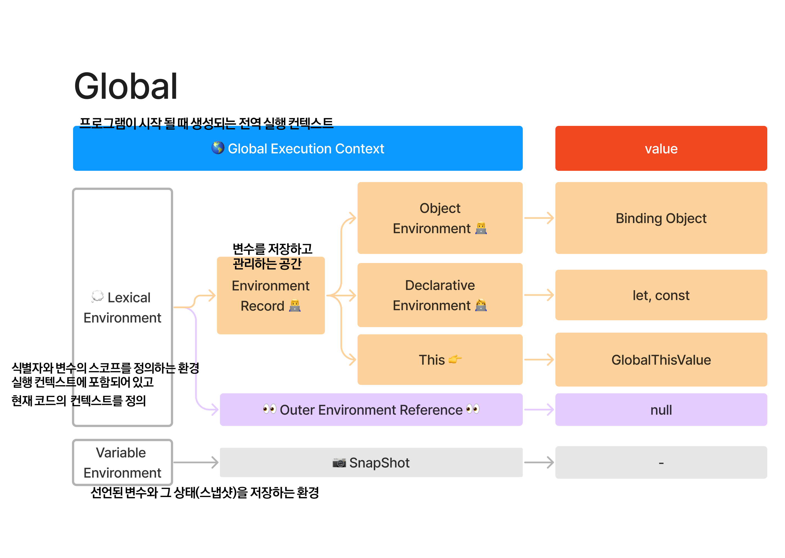
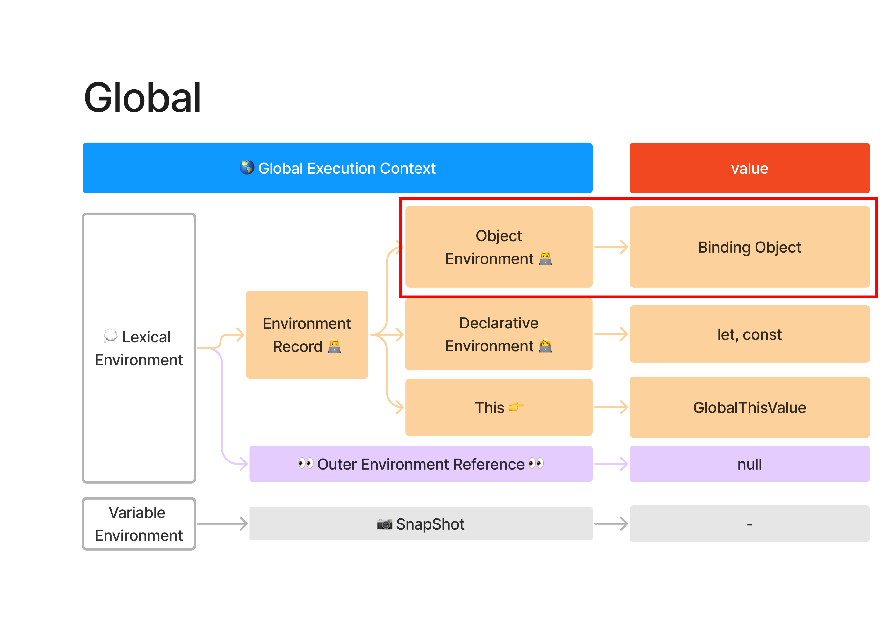
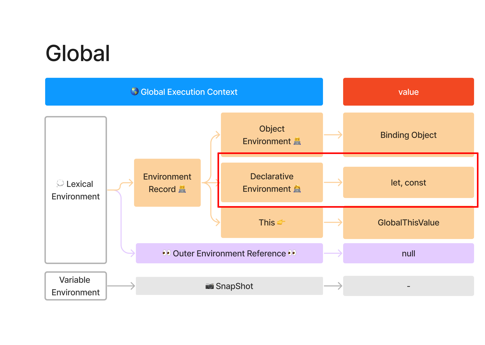

## 호이스팅이란?

JavaScript 호이스팅은 인터프리터가 코드를 실행하기 전에 함수, 변수, 클래스 또는 임포트(import)의 선언문을 해당 범위의 맨 위로 끌어올리는(hoisted) 것처럼 보이는 현상

### ex )

```js
function sayHi() {
  phrase = "Hello";

  console.log(phrase);

  var phrase;
}
sayHi(); //Hello
```

`var phrase`가 위로 이동한 것(아래 코드)처럼 출력된다.

```js
function sayHi() {
  var phrase;

  phrase = "Hello";

  console.log(phrase);
}
sayHi(); //Hello
```

---

## 왜 호이스팅은 일어나는가

### 역사적 이유

브랜든 아이크(JS의 창시자)는 var 호이스팅이 의도치 않은 것이라는 점을 명확히 하는 후속 트윗을 남겼다.

    @aravind030792 var 호이스팅은 함수 호이스팅의 의도치 않은 결과였으며, 블록 스코프가 없고, JS는 1995년의 급조 작업이었다. ES6의 'let'이 도움이 될 수 있다.

    — BrendanEich (@BrendanEich) 2014년 10월 15일

### 인터프리터 성능 이유

JavaScript 엔진이 코드를 컴파일할 때, 먼저 파싱이라는 과정을 거치며, 이 과정에서 코드를 더 작고 관리하기 쉬운 조각으로 나눈다.

함수 선언을 실행 전에 해당 스코프의 맨 위로 이동시킴으로써, 인터프리터는 함수가 호출될 때마다 함수 선언을 찾을 필요가 없어진다. 대신, 메모리에서 직접 함수를 실행할 수 있어 더 빠르고 효율적일 수 있습니다.

#### 호이스팅의 두가지 이점

- **함수 선언을 정의하기 전에 사용할 수 있게 해준다.** 이는 같은 스코프 내에서 호출되는 위치와 관계없이 함수 코드를 배치할 수 있게 한다.

- **인터프리터의 성능을 향상시킨다.** 변수 선언이 컴파일 중에 해당 스코프의 맨 위로 이동되기 때문에, JavaScript 엔진이 코드를 파싱하는 데 필요한 시간을 줄일 수 있습니다.

https://dev.to/jwwnz/javascript-hoisting-what-it-is-and-why-it-was-implemented-51ep

## JS 실행 컨텍스트에서 var, let, const, 함수의 호이스팅과 특징

### 전역 실행 컨텍스트



- Global Execution Context - 프로그램이 시작될 때 생성되는 전역 실행 컨텍스트\*
- Lexical Environment - 식별자와 변수의 스코프를 정의하는 환경. 실행 컨텍스트에 포함되어 있고 현재 코드의 컨텍스트를 정의한다.
- Environment Record - 변수를 저장하고 관리하는 공간
- Variable Environment - 선언된 변수와 그 상태(스냅샷)을 저장하는 환경

**+함수가 실행될 때 마다 새로운 Lexical Environment가 생성되고 사라진다.**

> 실행 컨텍스트\* - 함수나 전역 코드가 실행되는 동안 관련된 변수, 함수, 객체, 스코프 등을 정의하고 관리하는 구조를 제공합니다.

---

## var의 호이스팅



var로 선언된 변수는 선언과 동시에 `undefined`로 초기화되며, 실행 컨텍스트의 Object Environment Record에 등록된다.

전역에서 `var`로 선언한 변수는 window 객체(또는 Node.js에서는 global 객체)의 속성으로 추가된다. 전역 var 변수는 Lexical Environment 내의 Object Environment에 저장되어, 전역 실행 컨텍스트에서 참조할 수 있습니다.\*

서두의 예시처럼

**선언전 호이스팅**됩니다.

```js
function sayHi() {
  phrase = "Hello";

  console.log(phrase);

  var phrase;
}
sayHi(); //Hello
```

`var phrase`가 위로 이동한 것(아래 코드)처럼 출력된다.

```js
function sayHi() {
  var phrase;

  phrase = "Hello";

  console.log(phrase);
}
sayHi(); //Hello
```

**블록스코프를 무시하고, 함수 스코프와 전역 스코프만을 가진다.**

따라서 아래의 예시도 위와 같이 동작한다.

```js
function sayHi() {
  phrase = "Hello";

  if (false) {
    var phrase;
  }

  console.log(phrase);
}
sayHi(); //Hello
```

따라서 반복문, 조건문에서 선언된 `var` 변수도 전역의 영향을 받는다.

**선언은 호이스팅 되지만 할당은 호이스팅 되지 않는다.**

```js
function sayHi() {
  var phrase; // 선언은 함수 시작 시 처리됨.

  console.log(phrase); // undefined

  phrase = "Hello"; // 할당은 실행 흐름이 해당 코드에 도달했을 때 처리됨.
}

sayHi();
```

## let, const의 호이스팅



### let, const는 호이스팅이 되지 않는다?

```js
console.log(y); // ReferenceError: Cannot access 'y' before initialization
let y = 20;
console.log(y); // 20
```

그 이유는 다음과 같다.
let과 const변수를 선언하면, 선언부 환경(Declarative Environment)에 등록된다.
선언된 let과 const는 **TDZ(Temporal Dead Zone, 일시적 소멸구간)** 에 있어 참조할 수 없다.

즉 let, const 변수는 **선언 전에 접근할 수 없고, 선언 이후에 사용**할 수 있다.

### 그러나 이런 참조를 보면 끌어올려지는(hoisted) 것을 확인할 수 있다.

```js
const x = 1;
{
  console.log(x); // 참조 에러
  const x = 2;
}
```

만약 `const x = 2` 선언이 전혀 호출되지 않는다면(즉, 실행될 때만 효력이 발생한다면), `console.log(x)` 문은 상위 범위에서 x 값을 읽을 수 있어야 한다. 그러나 const 선언은 여전히 정의된 전체 범위를 "오염"시키기 때문에 `console.log(x)` 문은 아직 초기화되지 않은 `const x = 2` 선언에서 x를 대신 읽어서 `ReferenceError`를 던집니다. 하지만 실용적인 관점에서 볼 때 이러한 선언의 호이스팅은 의미 있는 기능을 제공하지 않기 때문에 어휘 선언을 비호이스팅으로 특성화하는 것이 더 유용할 수 있다.

---

## 함수의 호이스팅

function 선언은 전체 함수 정의가 호이스된다. 함수 선언문(function myFunc() { ... })은 변수와 달리 전체가 호이스팅되므로, 선언 위치와 관계없이 함수 호출이 가능하다.

```js
console.log(square(5)); // `25`

function square(n) {
  return n * n;
}
```

이 코드는 square 함수가 정의되기 전에 호출되었지만 오류 없이 실행된다. JavaScript 인터프리터가 전체 함수 선언을 현재 스코프의 최상단으로 끌어올려지기 때문에 위의 코드는 다음과 같다.

````js
// ```모든 함수 선언이 스코프의 최상단으로 끌어올려짐.
function square(n) {
  return n * n;
}

console.log(square(5)); // `25`
````

### 함수 호이스팅은 함수 선언에만 적용되고 함수 표현식에선 쓸 수 없다.

```js
console.log(square); // ReferenceError: 초기화 되기 전에는 `square`에 접근할 수 없다.

const square = function (n) {
  return n * n;
};
```

함수 선언은 **컴파일 시점\***에 전체 함수가 호이스팅되므로 함수 호출이 어디서든 가능하다.

함수 표현식은 변수 할당의 형태를 띠고 있기 때문에 **런타임 시점\***에 할당이 이루어진다. 따라서 호이스팅되는 것은 함수가 아닌 변수 자체이며, 할당이 완료되기 전에는 호출할 수 없다.

> 컴파일 시점\*- 소스 코드가 실행되기 전에 발생하는 시점

> 런타임 시점\*- 실제 코드 실행 시점

---

참고 출처

https://developer.mozilla.org/ko/docs/Glossary/Hoisting

멋쟁이사자처럼 프론트엔드 12기 JS 수업 - 신성범 강사님

https://ko.javascript.info/var
